# ChessApp

## 📋 Description

ChessApp is a full-stack chess game application built using **ASP.NET Core** for the backend and **React (TypeScript)** for the frontend.  
It offers real-time gameplay with a lobby system, game creation features, user nickname settings, and several additional functionalities to enhance your chess experience.

## ✨ Features

- **Chess Gameplay:**  
  Complete chess game with standard chess rules, including:
  - Standard piece movements
  - Castling / En Passant
  - Promotion to Queen
  - Check / Checkmate / Stalemate
  - Fifty-move rule
  - Insufficient material rule
  - Threefold repetition rule

- **Real-time Communication:**  
  Utilizes **SignalR** for real-time communication to synchronize player moves and lobby updates instantly between users and players.

- **Lobby System:**  
  Browse available games, select one, and join to play.

- **User Nickname Settings:**  
  Set and update your username.

- **Navigation Bar:**  
  Navigate easily through the application with the integrated navbar.

- **Moves History:**  
  View a history of all moves made during the game.

- **Captured Pieces Display:**  
  See a visual display of captured pieces during the game.

- **Timers:**  
  Built-in timers display each player's remaining time.

- **Observer:**  
  Users joining a game that already has two players will automatically assume an observer role, allowing them to watch the game in progress.

## 🛠️ Technologies

- **Backend:** ASP.NET Core
- **Frontend:** React with TypeScript
- **Real-time Communication:** SignalR
- **Styling:** CSS / SCSS

## 📂 Application

Below are screenshots demonstrating the core functionality and user interface of ChessApp.

### Home Page:

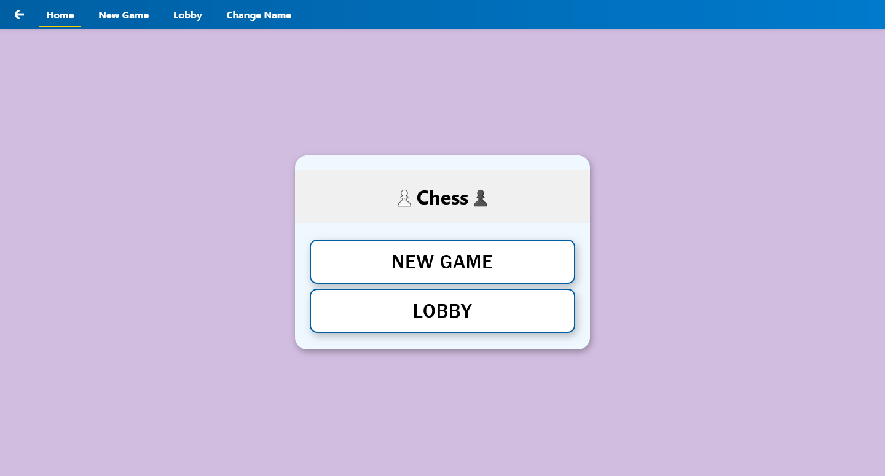

### Lobby Page:

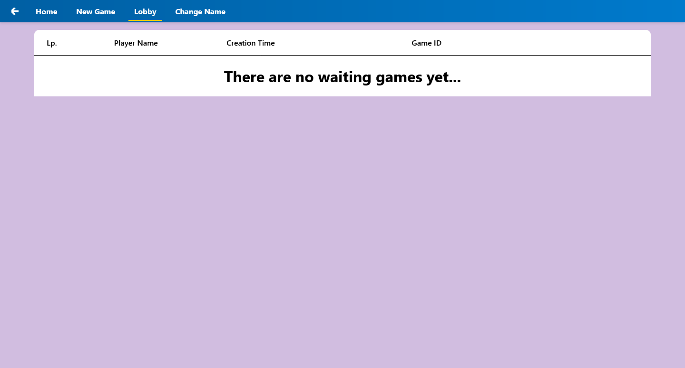  
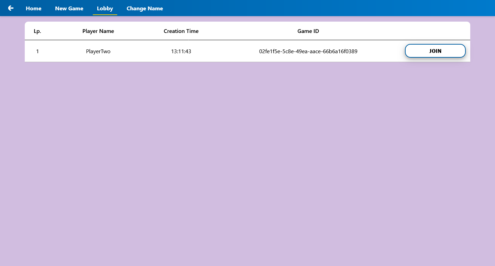

### Create Game Page:

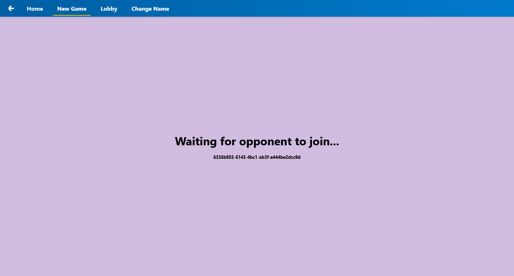

### Change Username Page:

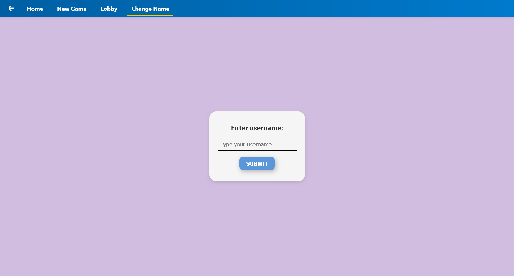

### Game Page:

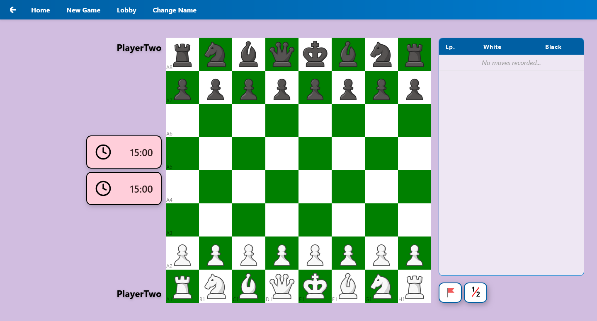  
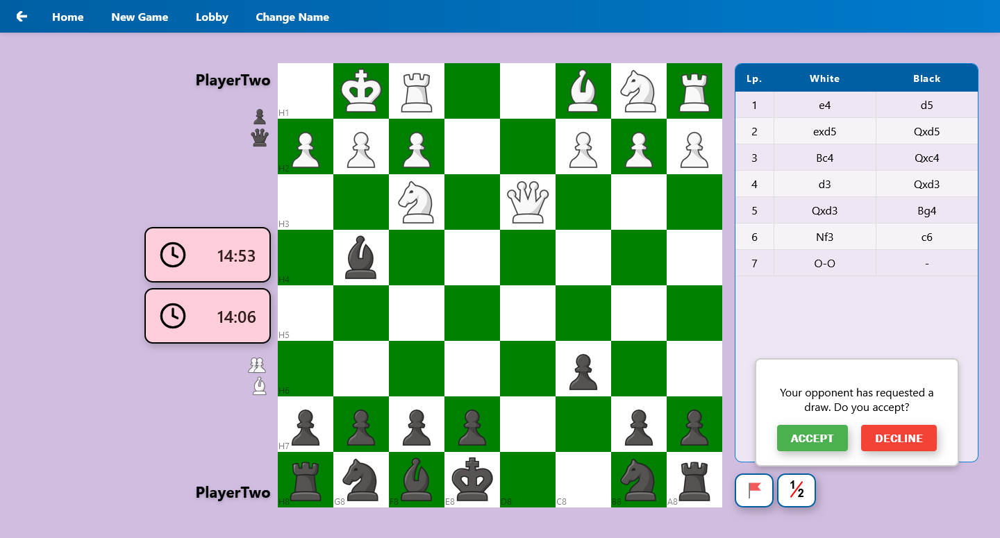

#### Moves History:

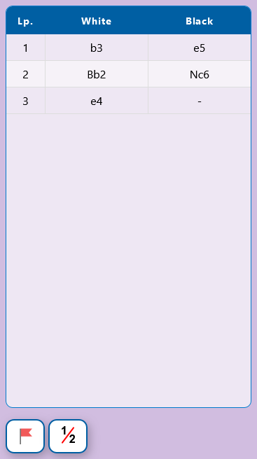

#### Game Results:

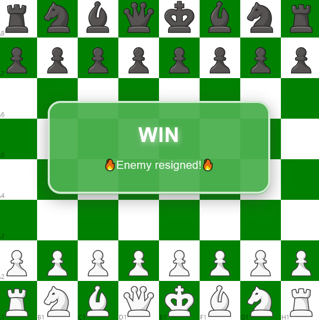  
  
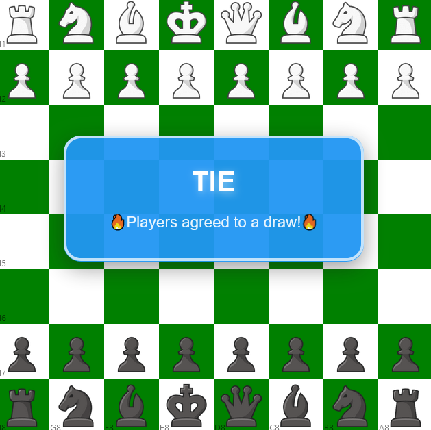  
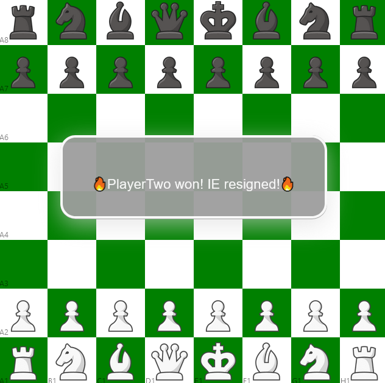

## Prerequisites

- [.NET 8 SDK](https://dotnet.microsoft.com/download) (or later)
- [Node.js](https://nodejs.org/) (v14 or above)
- [Yarn](https://yarnpkg.com/) or npm

## 🚀 Installation

1. **Clone the repository**

    Clone the repository to your local machine by running the following command:
    ```bash
    git clone https://github.com/DamianSubzda/ChessApp.git
    ```

2. **Backend (ASP.NET Core) Setup**

    - Ensure that the .NET SDK is installed.
    - Navigate to the `ChessApp.Server` project directory.
    - Run the following commands to build and run the backend:
      ```bash
      dotnet restore
      dotnet build
      dotnet run
      ```

3. **Frontend (React) Setup**

    - Ensure that Node.js and npm (or Yarn) are installed.
    - Navigate to the `ChessApp.Client` directory.
    - Install the necessary dependencies:
      ```bash
      npm install
      # or if you prefer yarn:
      yarn install
      ```
    - Start the React development server:
      ```bash
      npm start
      ```

## 📄 License

The application is available under the MIT License. See the LICENSE file for details.
